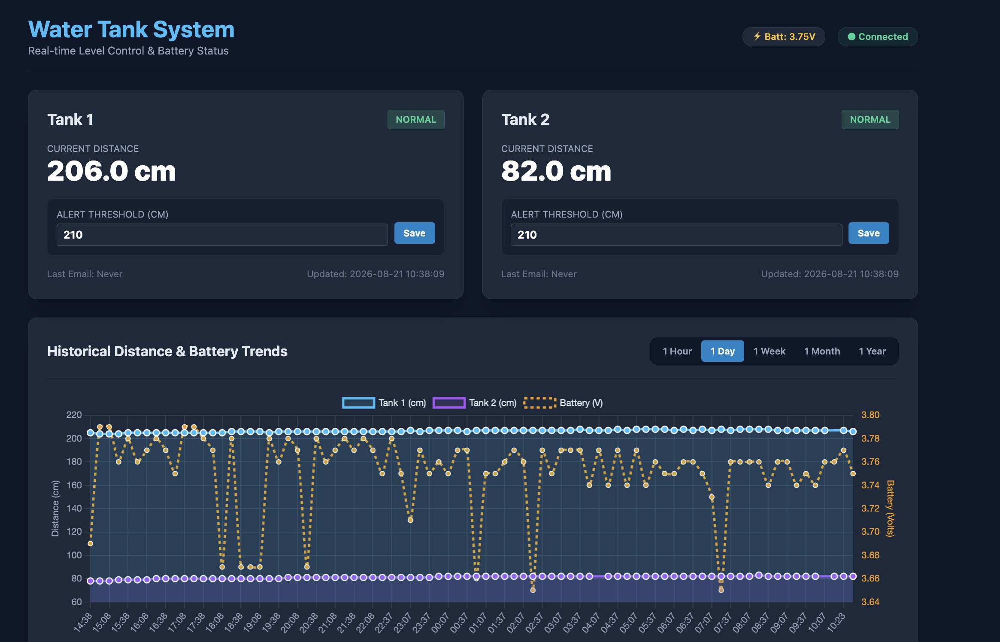

# 🚰 Water Tank & Battery Monitoring System

A lightweight, production-ready IoT dashboard built with **Flask**, **SQLite**, **Tailwind CSS**, and **Chart.js** to monitor water levels (via ultrasonic distance sensors) and battery health for multiple water tanks. Served using **Gunicorn** and managed as a **systemd** daemon.

---

## 📋 Table of Contents
- [Features](#features)
- [Architecture & Tech Stack](#architecture--tech-stack)
- [Prerequisites & Package Setup](#prerequisites--package-setup)
- [Configuration Reference](#configuration-reference)
- [Running directly with Gunicorn](#running-directly-with-gunicorn)
- [Systemd Service Setup](#systemd-service-setup)
- [Hardware Integration & Microcontroller Payload](#hardware-integration--microcontroller-payload)
- [Arduino IDE Dependencies](#arduino-ide-dependencies)
- [API Reference](#api-reference)

---

## Features

* **Production-Grade WSGI Server**: Uses Gunicorn worker processes for stable concurrency and auto-restart handling.
* **Real-Time Web Dashboard**: Auto-refreshes every 3 seconds to reflect incoming sensor data instantly.
* **Merged Timeline Charts**: Multi-axis dynamic display tracking Tank 1 (cm), Tank 2 (cm), and Battery (Volts) across configurable spans (`1h`, `1d`, `1w`, `1m`, `1y`).
* **Automated Email Alerts**: Multi-threaded SMTP notifications triggered when a water distance exceeds threshold levels (rate-limited to 1 alert per 24 hours per tank).
* **System-Level Timezone Integration**: Uses `tzlocal` to match system host clock automatically via `/etc/timezone`.
* **Zero Virtual Environment Footprint**: Runs using system-wide Debian/Ubuntu APT packages (`gunicorn`, `python3-flask`, `python3-tzlocal`).


---

## Architecture & Tech Stack


- ▼ [ESP32 Sensor Node]
- ▼ HTTP POST /api/reading
- ▼ Gunicorn WSGI 
- ▼ Flask Server (app:app)
- ▼ SQLite Database (tanks.db)
- ▼ Background Email Worker (smtplib)
- ▼ HTTP GET / Dashboard
- Tailwind CSS + Chart.js Web UI


##  Prerequisites & Package Setup

Install Gunicorn alongside all application dependencies directly using Debian/Ubuntu package management:

```bash
sudo apt update
sudo apt install gunicorn python3-flask python3-tz python3-tzlocal python3-requests
```
System Timezone SetupEnsure your host machine is configured to your local timezone: (please with your localtimezone, list of timezones https://en.wikipedia.org/wiki/List_of_tz_database_time_zones )

```Bash
sudo timedatectl set-timezone Australia/Brisbane
```

## Configuration Reference

All configurations are defined at the top of app.py:
```bash
DB_FILE "tanks.db" #  SQLite database file location
SMTP_HOSTstr"smtp.gmail.com"  # Outgoing SMTP server host
SMTP_PORT  465 # Outgoing SMTP SSL port
SENDER_EMAIL   "your@gmaillind.com"  # Sender email address for alerts
SENDER_PASSWORD   "xxxx xxxx xxxx xxxx"  # SMTP App Password
RECIPIENT_EMAIL   "your@gmail.com"  # Alert notification recipient
LOCAL_TZ  objectget_localzone()  # Automatically reads OS host timezone
```
## How to setup a App password for gmail

https://support.google.com/mail/answer/185833?hl=en
 
## Running directly with Gunicorn
Before enabling systemd, verify Gunicorn can execute your Flask application (app.py).
Navigate to your application directory:
```bash
    cd ~/tank-monitor
```

Run Gunicorn using 2 worker processes binding to all interfaces on port 5000:

```bash
gunicorn --workers 2 --bind 0.0.0.0:5000 app:app
```

Open http://'<your-server-ip'>:5000 in a browser.

Press Ctrl+C to stop.

##  Systemd Service Setup

Setting up systemd ensures Gunicorn automatically boots at system startup and restarts if a process fails.
1. Create Systemd Service File

```bash
sudo nano /etc/systemd/system/tank-monitor.service
```
2. Paste Configuration

```systemd
Description=Water Tank & Battery Monitor (Gunicorn)
After=network.target

[Service]
User=felipe
Group=www-data
WorkingDirectory=/home/felipe/tank-monitor
ExecStart=/usr/bin/gunicorn --workers 2 --bind 0.0.0.0:5000 --access-logfile - --error-logfile - app:app
Restart=always
RestartSec=5
Environment=PYTHONUNBUFFERED=1

[Install]
WantedBy=multi-user.target
```

3. Reload, Enable, and StartBash# Reload systemd manager configuration
```
sudo systemctl daemon-reload
```

# Enable service to run on system boot
```
sudo systemctl enable tank-monitor.service
```

# Start the service now
```
sudo systemctl start tank-monitor.service
```

4. Check Service Status & LogsVerify the service is running (active (running)):i

```
sudo systemctl status tank-monitor.service
```

Stream live application logs (Gunicorn access + Flask runtime logs):
```
sudo journalctl -u tank-monitor.service -f
```

## Hardware Integration & Microcontroller Payload

Microcontrollers (tested on ESP32S3) submit telemetry data via HTTP POST.


## ESP32 Microcontroller Setup

### 1. Hardware & Wiring Overview

The sensor node uses an ESP32 connected to an HC-SR04 / JSN-SR04T ultrasonic sensor and a voltage divider circuit for monitoring a 3.7V–4.2V Li-Ion/LiPo battery.

*** ESP32-S3 Development Board

https://s.click.aliexpress.com/e/_c3Q1CH4J


*** Waterproof Ultrasonic Module JSN-SR04T 

https://s.click.aliexpress.com/e/_c3AjJmpd


| Component | ESP32 Pin | Description |
| :--- | :--- | :--- |
| **Ultrasonic Trigger sensor 1 ** | `GPIO 4` | Sends ultrasonic pulse trigger |
| **Ultrasonic Echo sensor 1 ** | `GPIO 5` | Measures echo pulse return time |
| **Ultrasonic Trigger sensor 2 ** | `GPIO 6` | Sends ultrasonic pulse trigger |
| **Ultrasonic Echo sensor 2 ** | `GPIO 7` | Measures echo pulse return time |
| **Battery ADC ** | `GPIO 1` | Reads analog voltage via divider (ADC1) |
| **3.3v for sensors  ** | `3.3v` | power for sensors |
| ** Ground for sensors ** | GND | ground for sensors |
| **Battery ADC ** | `GPIO 1` | Reads analog voltage via divider (ADC1) |

 ⚠️ **ADC Pin Selection:** Use ADC1 pins (`GPIO 1 - 20`) on the ESP32. 

---
### 2. Wifi setup

When first powered on connect to the ESP32 AP "ESP32_Tank_Monitor_AP" to setup you local wifi

### 3. Battery Voltage Monitoring Circuit

The ESP32's ADC pins accept a maximum input voltage of **3.3V**. Since a fully charged Li-Ion battery outputs up to **4.2V**, a resistor voltage divider is required to scale the voltage down safely.


#### Wiring Diagram
- [ Battery (+) ] ─── R1 (100kΩ) ──┬─── GPIO (1 - 20)  (ESP32 ADC)
- │
- R2 (100kΩ)
- │
- [ Battery (-) ] ────────────────┴─── GND (ESP32)

*** resister pack from Aliexpress 

https://s.click.aliexpress.com/e/_c3VNyzwT


*** use a buck convertor to supply 3.3v to the supply pin on your ESP32. **

*** LM2596 DC to DC Buck Converter
 
https://s.click.aliexpress.com/e/_c3P3ATCr

#### Solar setup

I use a simple solar setup to keep the system running without the need to recharge,

*** 6V 1.26W 210MA Mini Solar Panel 133X73MM 

https://s.click.aliexpress.com/e/_c42ryfxN

*** 3.7V 10000mAh 1260110 Rechargeable Polymer Batteries  

https://s.click.aliexpress.com/e/_c3NPA5Rz

I did not use the battery indicator as the voltage is monitored via the ESP32.

Wiring for solar charger to ESP32 (SYS OUT)

| **3.3v ** | `3.3v` | power from solar controller |
| ** Ground ** | GND | ground from solar controller|

## Enclouser

## IP67 Waterproof Transparent Cover Enclosure 

https://s.click.aliexpress.com/e/_c4szENsP

had to drill a few hoses to the the wires for the sensors and solar panel.

I also added an antenna to the ESP32 which required a hole.
I used one of these

https://s.click.aliexpress.com/e/_c4piCnsr

Sealed all holes with Roof Gutter Silicone.


###  Arduino IDE Dependencies

To compile the C++ code, ensure you have the **ESP32 Board Package** installed in your Arduino IDE, then install the following libraries via **Sketch ➔ Include Library ➔ Manage Libraries**:

*   **`WiFiManager`** by tzapu (Creates a captive portal to connect to Wi-Fi without hardcoding passwords)
*   **`ArduinoJson`** by Benoit Blanchon (Formats the data into JSON to post to the Flask server)
*   **`AsyncDelay`** by Steve Marple (Handles non-blocking time delays)
*   **`jsnsr04t`** (Handles the timing and math for the JSN-SR04T sensor)

*(Note: `WiFi.h` and `HTTPClient.h` are built-in and do not need to be downloaded).*

## API Reference

All requests and responses use standard JSON encoding. Base URL format: `http://<server-ip>:5000`

### Summary of Endpoints

| Method | Endpoint | Description |
| :--- | :--- | :--- |
| `POST` | `/api/reading` | Submit new tank measurement and battery telemetry |
| `GET` | `/api/status` | Retrieve latest status, thresholds, and alert timestamps |
| `POST` | `/api/threshold` | Update alert threshold distance for a specified tank |
| `GET` | `/api/history` | Fetch aggregated historical trends for dashboard charting |

---

### 1. Submit Tank Reading

Posts distance and battery data collected from a microcontroller node (e.g., ESP32). Stores the entry with a local timestamp and evaluates alert conditions.

* **URL:** `/api/reading`
* **Method:** `POST`
* **Headers:** `Content-Type: application/json`

#### Request Body
| Field | Type | Required | Description |
| :--- | :--- | :--- | :--- |
| `tank_id` | `string` | **Yes** | Identifier (`"tank1"` or `"tank2"`) |
| `distance` | `float` | **Yes** | Water surface distance measurement in centimeters |
| `battery` | `float` | No | Current supply/battery voltage (Default: `0.0`) |

*Example Request Payload:*
```json
{
  "tank_id": "tank1",
  "distance": 45.5,
  "battery": 3.82
}
